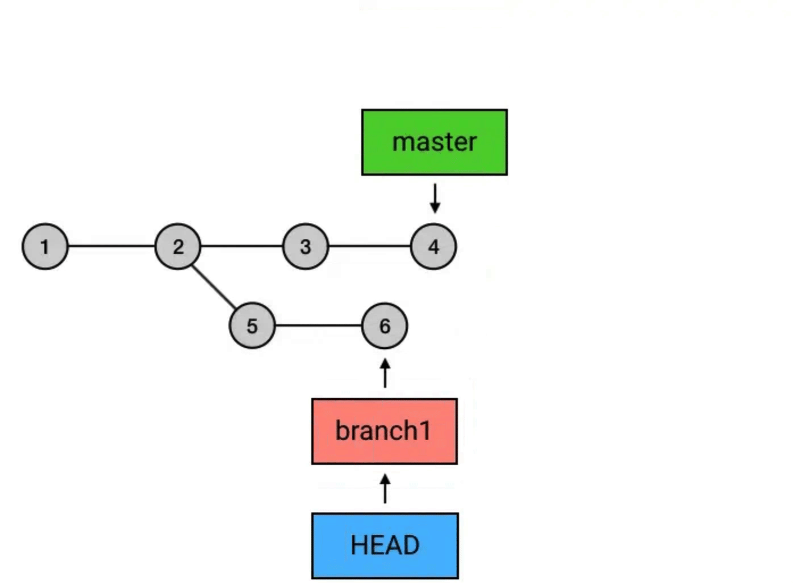
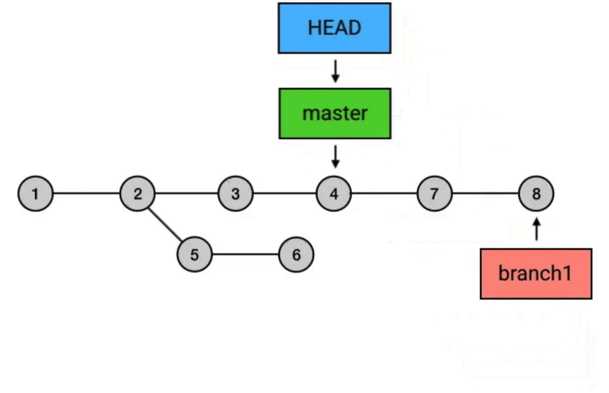

有些人不喜欢 `merge`，因为在 `merge` 之后，`commit` 历史就会出现分叉，这种分叉再汇合的结构会让有些人觉得混乱而难以管理。如果你不希望 `commit` 历史出现分叉，可以用 `rebase` 来代替 `merge`。

## rebase——在新位置重新提交

`rebase` ，又是一个中国人看不懂的词。这个词的意思，你如果查一下的话：


> 哈？玩个 Git 就弯了？

其实这个翻译还是比较准确的。`rebase` 的意思是，给你的 `commit` 序列重新设置基础点（也就是父 `commit`）。展开来说就是，把你指定的 `commit` 以及它所在的 `commit` 串，以指定的目标 `commit` 为基础，依次重新提交一次。例如下面这个 `merge`：

```shell
git merge branch1
```


如果把 `merge` 换成 `rebase`，可以这样操作：

```shell
git checkout branch1
git rebase master
```



可以看出，通过 `rebase`，`5` 和 `6` 两条 `commit`s 把基础点从 `2` 换成了 `4` 。通过这样的方式，就让本来分叉了的提交历史重新回到了一条线。这种「重新设置基础点」的操作，就是 `rebase` 的含义。

另外，在 `rebase` 之后，记得切回 `master` 再 `merge` 一下，把 `master` 移到最新的 `commit`：

```shell
git checkout master
git merge branch1
```



> 为什么要从 `branch1` 来 `rebase`，然后再切回 `master` 再 `merge` 一下这么麻烦，而不是直接在 `master` 上执行 `rebase`？
>
> 从图中可以看出，`rebase` 后的 `commit` 虽然内容和 `rebase` 之前相同，但它们已经是不同的 `commits` 了。如果直接从 `master` 执行 `rebase` 的话，就会是下面这样：
>
> 
>
> 这就导致 `master` 上之前的两个最新 `commit` 被剔除了。如果这两个 `commit` 之前已经在中央仓库存在，这就会导致没法 `push` 了：
>
> 
>
> 所以，为了避免和远端仓库发生冲突，一般不要从 `master` 向其他 `branch` 执行 `rebase` 操作。而如果是 `master` 以外的 `branch` 之间的 `rebase`（比如 `branch1` 和 `branch2` 之间），就不必这么多费一步，直接 `rebase` 就好。

## 小结

`rebase` 指令可以改变 `commit` 序列的基础点。
它的使用方式很简单：

```shell
git rebase 目标基础点
```

需要说明的是，`rebase` 是站在需要被 `rebase` 的 `commit` 上进行操作，这点和 `merge` 是不同的。
