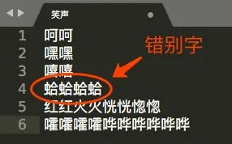
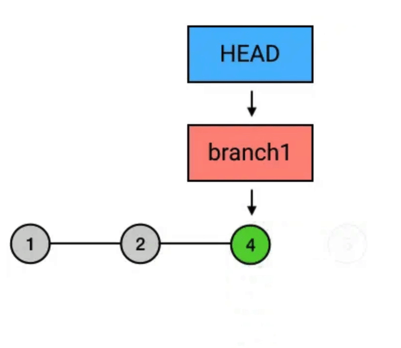

刚提交了一个代码，发现有几个字写错了：



怎么修复？

当场再写一个修复这几个错别字的 `commit`？可以是可以，不过还有一个更加优雅和简单的解决方法：`commit -—amend`。

"amend" 是「修正」的意思。在提交时，如果加上 `--amend` 参数，Git 不会在当前 `commit` 上增加 `commit`，而是会把当前 `commit` 里的内容和暂存区（stageing area）里的内容合并起来后创建一个新的 `commit`，**用这个新的 `commit` 把当前 `commit` 替换掉**。所以 `commit --amend` 做的事就是它的字面意思：对最新一条 `commit` 进行修正。

具体地，对于上面这个错误，你就可以把文件中的错别字修改好之后，输入：

```shell
git add 笑声.txt git commit --amend
```


Git 会把你带到提交信息编辑界面。可以看到，提交信息默认是当前提交的提交信息。你可以修改或者保留它，然后保存退出。然后，你的最新 `commit` 就被更新了。



## 小结

用 `commit --amend` 可以修复当前提交的错误。使用方式：

```shell
git commit --amend
```

需要注意的有一点：`commit --amend` 并不是直接修改原 `commit` 的内容，而是生成一条新的 `commit`。
