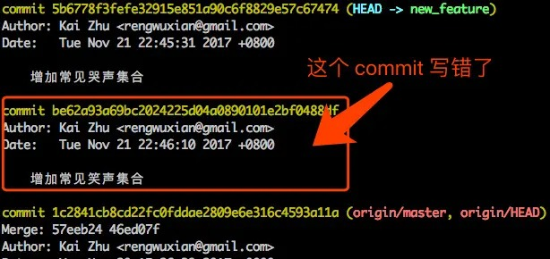
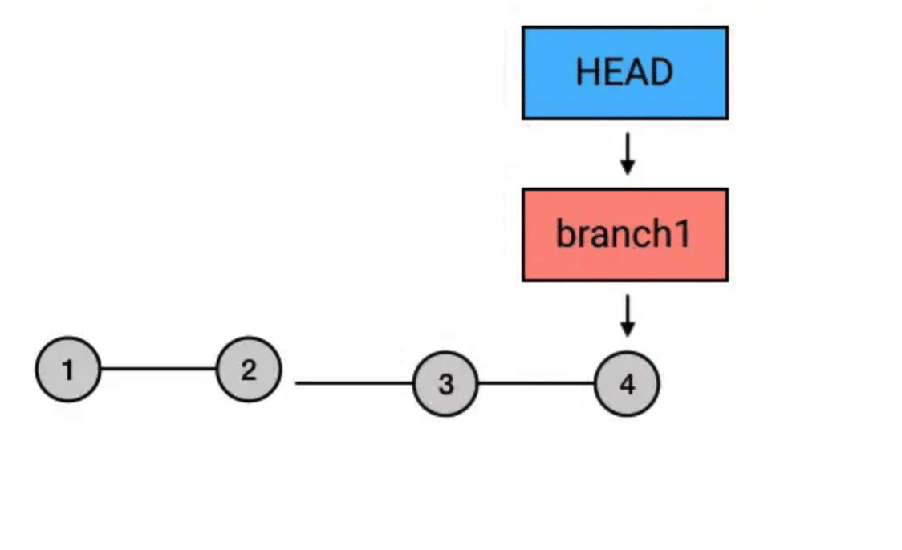
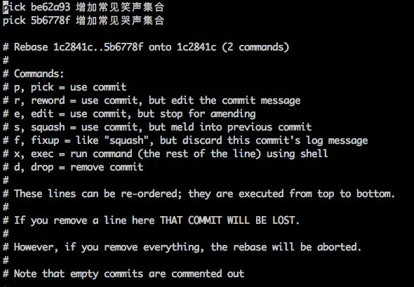
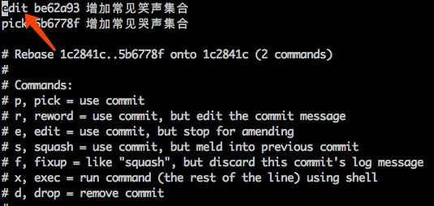
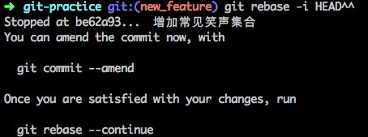
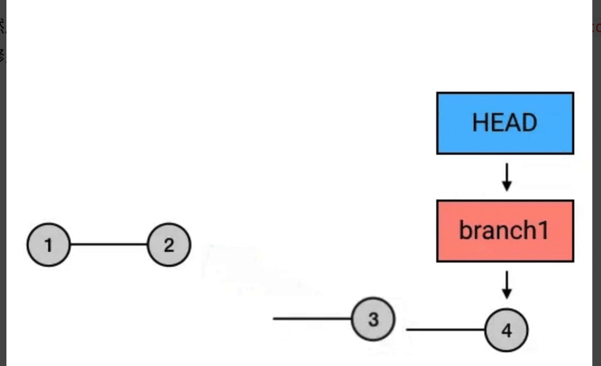

`git commit --amend` 可以修复最新 `commit` 的错误，但如果是倒数第二个 `commit` 写错了，怎么办？

## rebase -i：交互式 rebase

如果不是最新的 `commit` 写错，就不能用 `commit --amend` 来修复了，而是要用 `rebase`。不过需要给 `rebase` 也加一个参数：`-i`。

`rebase -i` 是 `rebase --interactive` 的缩写形式，意为「交互式 rebase」。

所谓「交互式 rebase」，就是在 `rebase` 的操作执行之前，你可以指定要 `rebase` 的 `commit` 链中的每一个 `commit` 是否需要进一步修改。

那么你就可以利用这个特点，进行一次「原地 rebase」。

例如你是在写错了 `commit` 之后，又提交了一次才发现之前写错了：

```shell
git log
```



### 开启交互式 rebase 过程

现在再用 `commit --amend` 已经晚了，但可以用 `rebase -i`：

```shell
git rebase -i HEAD^^
```

> 说明：在 Git 中，有两个「偏移符号」： `^` 和 `~`。
>
> `^` 的用法：在 `commit` 的后面加一个或多个 `^` 号，可以把 `commit` 往回偏移，偏移的数量是 `^` 的数量。例如：`master^` 表示 `master` 指向的 `commit` 之前的那个 `commit`； `HEAD^^` 表示 `HEAD` 所指向的 `commit` 往前数两个 `commit`。
>
> `~` 的用法：在 `commit` 的后面加上 `~` 号和一个数，可以把 `commit` 往回偏移，偏移的数量是 `~` 号后面的数。例如：`HEAD~5` 表示 `HEAD` 指向的 `commit`往前数 5 个 `commit`。

上面这行代码表示，把当前 `commit` （ `HEAD` 所指向的 `commit`） `rebase` 到 `HEAD` 之前 2 个的 `commit` 上：



如果没有 `-i` 参数的话，这种「原地 rebase」相当于空操作，会直接结束。而在加了 `-i` 后，就会跳到一个新的界面：



### 编辑界面：选择 commit 和对应的操作

这个编辑界面的最顶部，列出了将要「被 rebase」的所有 `commit`s，也就是倒数第二个 `commit` 「增加常见笑声集合」和最新的 `commit`「增加常见哭声集合」。需要注意，这个排列是正序的，旧的 `commit` 会排在上面，新的排在下面。

这两行指示了两个信息：

1.  需要处理哪些 `commits`；
2.  怎么处理它们。

你需要修改这两行的内容来指定你需要的操作。每个 `commit` 默认的操作都是 `pick` （从图中也可以看出），表示「直接应用这个 `commit`」。所以如果你现在直接退出编辑界面，那么结果仍然是空操作。

但你的目标是修改倒数第二个 `commit`，也就是上面的那个「增加常见笑声集合」，所以你需要把它的操作指令从 `pick` 改成 `edit` 。 `edit` 的意思是「应用这个 commit，然后停下来等待继续修正」。其他的操作指令，在这个界面里都已经列举了出来（下面的 "Commands…" 部分文字），你可以自己研究一下。



把 `pick` 修改成 `edit` 后，就可以退出编辑界面了：



上图的提示信息说明，`rebase` 过程已经停在了第二个 `commit` 的位置，那么现在你就可以去修改你想修改的内容了。

### 修改写错的 commit

修改完成之后，和上节里的方法一样，用 `commit --amend` 来把修正应用到当前最新的 `commit`：

```shell
git add 笑声 git commit --amend
```


### 继续 rebase 过程

在修复完成之后，就可以用 `rebase --continue` 来继续 `rebase` 过程，把后面的 `commit` 直接应用上去。

```shell
git rebase --continue
```


然后，这次交互式 `rebase` 的过程就完美结束了，你的那个倒数第二个写错的 `commit` 就也被修正了：



实质上，交互式 `rebase` 并不是必须应用在「原地 rebase」上来修改写错的 `commit` ，这只不过是它最常见的用法。你同样也可以把它用在分叉的 `commit` 上，不过这个你就可以自己去研究一下了。

## 小结

交互式 `rebase`可以在 `rebase` 开始之前指定一些额外操作。交互式 `rebase` 最常用的场景是修改写错的 `commit`，但也可以用作其他用途。它的大致用法：

1.  使用方式是 `git rebase -i 目标commit`；
2.  在编辑界面中指定需要操作的 `commit`s 以及操作类型；
3.  操作完成之后用 `git rebase --continue` 来继续 `rebase` 过程。
