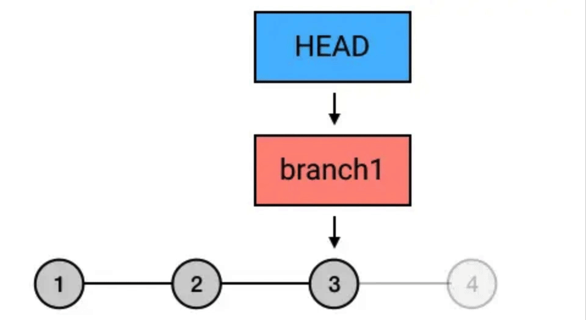
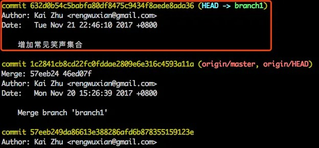
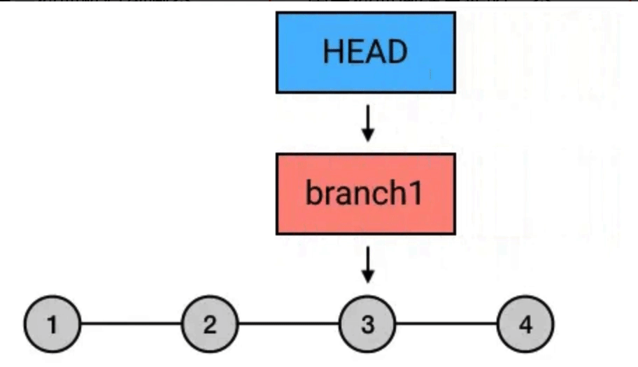

有的时候，刚写完的 `commit` 写得实在太烂，连自己的都看不下去，与其修改它还不如丢掉重写。这种情况，就可以用 `reset` 来丢弃最新的提交。

## reset --hard 丢弃最新的提交

比如你刚写了一个 `commit`：





写完回头看了看，你觉得「不行这得重新写」。那么你可以用 `reset --hard` 来撤销这条 `commit`。

```shell
git reset --hard HEAD^
```

> HEAD 表示 HEAD^ 往回数一个位置的 `commit` ，上节刚说过，记得吧？

`HEAD^` 表示你要恢复到哪个 `commit`。因为你要撤销最新的一个 `commit`，所以你需要恢复到它的父 `commit` ，也就是 `HEAD^`。那么在这行之后，你的最新一条就被撤销了：



不过，就像图上显示的，你被撤销的那条提交并没有消失，只是你不再用到它了。如果你在撤销它之前记下了它的 `SHA-1` 码，那么你还可以通过 `SHA-1` 来找到他它。

## 小结

撤销最新的提交的方式是通过 `reset --hard`：

```shell
git reset --hard 目标commit
```
