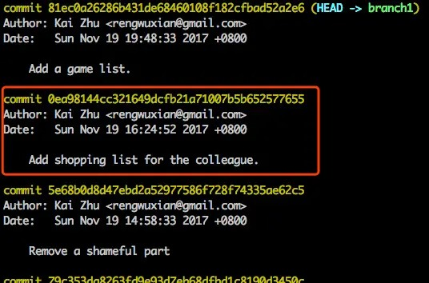
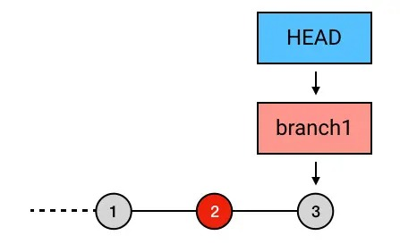
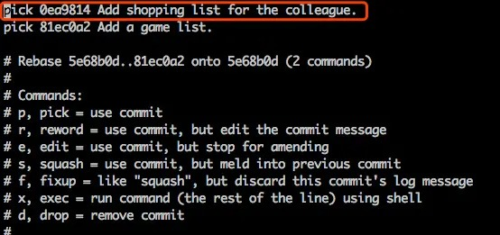
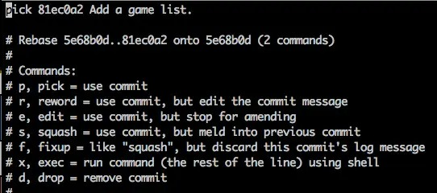
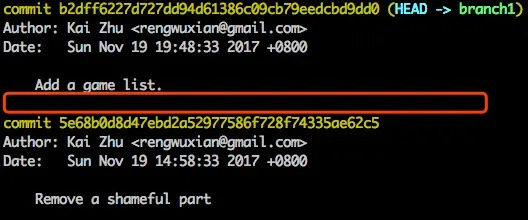
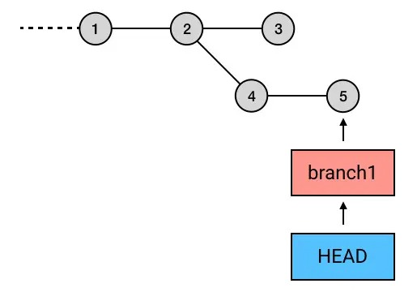
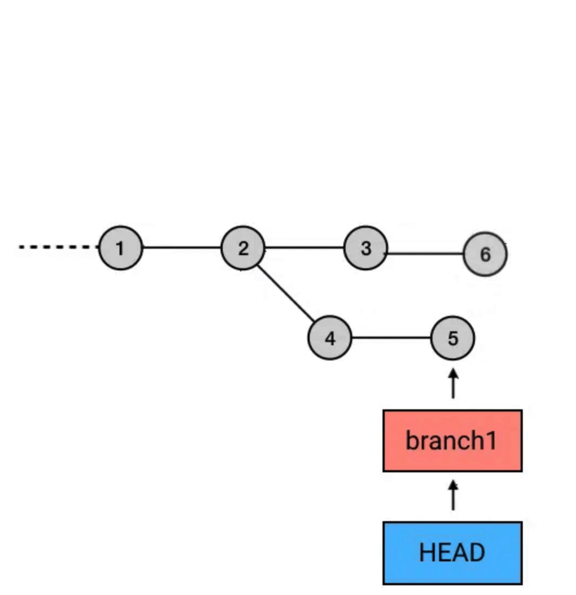

假如有一个 `commit` ，你在刚把它写完的时候并没有觉得它不好，可是在之后又写了几个提交以后，你突然灵光一现：「哎呀，那个 `commit` 不该写，我要撤销！」

不是最新的提交，就不能用 `reset --hard` 来撤销了。这种情况的撤销，就要用之前介绍过的一个指令：交互式 `rebase` ——`rebase -i`。

## 用交互式 rebase 撤销提交

之前介绍过，交互式 `rebase` 可以用来修改某些旧的 `commit`s。其实除了修改提交，它还可以用于撤销提交。比如下面这种情况：





你想撤销倒数第二条 `commit`，那么可以使用 `rebase -i`：

```shell
git rebase -i HEAD^^
```



然后就会跳到 `commit` 序列的编辑界面，这个在之前的第 10 节里已经讲过了。和第 10 节一样，你需要修改这个序列来进行操作。不过不同的是，之前讲的修正 `commit` 的方法是把要修改的 `commit` 左边的 `pick` 改成 `edit`，而如果你要撤销某个 `commit` ，做法就更加简单粗暴一点：直接删掉这一行就好。



`pick` 的直接意思是「选取」，在这个界面的意思就是应用这个 `commit`。而如果把这一行删掉，那就相当于在 `rebase` 的过程中跳过了这个 `commit`，从而也就把这个 `commit` 撤销掉了。


现在再看 `log`，就会发现之前的倒数第二条 `commit` 已经不在了。

```shell
git log
```



## 用 rebase --onto 撤销提交

除了用交互式 `rebase` ，你还可以用 `rebase --onto` 来更简便地撤销提交。

`rebase` 加上 `--onto` 选项之后，可以指定 `rebase` 的「起点」。一般的 `rebase`，告诉 Git 的是「我要把当前 `commit` 以及它之前的 `commit`s 重新提交到目标 `commit` 上去，这其中，`rebase` 的「起点」是自动判定的：选取当前 `commit` 和目标 `commit` 在历史上的交叉点作为起点。

例如下面这种情况：



如果在这里执行：

```shell
git rebase 第3个commit
```

那么 Git 会自动选取 `3` 和 `5` 的历史交叉点 `2` 作为 `rebase` 的起点，依次将 `4` 和 `5` 重新提交到 `3` 的路径上去。

而 `--onto` 参数，就可以额外给 rebase 指定它的起点。例如同样以上图为例，如果我只想把 `5` 提交到 `3` 上，不想附带上 `4`，那么我可以执行：

```shell
git rebase --onto 第3个commit 第4个commit branch1
```

`--onto` 参数后面有三个附加参数：目标 `commit`、起点 `commit`（注意：rebase 的时候会把起点排除在外）、终点 `commit`。所以上面这行指令就会从 `4` 往下数，拿到 `branch1` 所指向的 `5`，然后把 `5` 重新提交到 `3` 上去。



同样的，你也可以用 `rebase --onto` 来撤销提交：

```shell
git rebase --onto HEAD^^ HEAD^ branch1
```

上面这行代码的意思是：以倒数第二个 `commit` 为起点（起点不包含在 `rebase` 序列里哟），`branch1` 为终点，`rebase` 到倒数第三个 `commit` 上。

也就是这样：


## 小结

「撤销过往的提交」的方法有两种：

1.  用 `git rebase -i` 在编辑界面中删除想撤销的 `commit`s
2.  用 `git rebase --onto` 在 rebase 命令中直接剔除想撤销的 `commit`s

方法有两种，理念是一样的：在 `rebase` 的过程中去掉想撤销的 `commit`，让他它消失在历史中。
