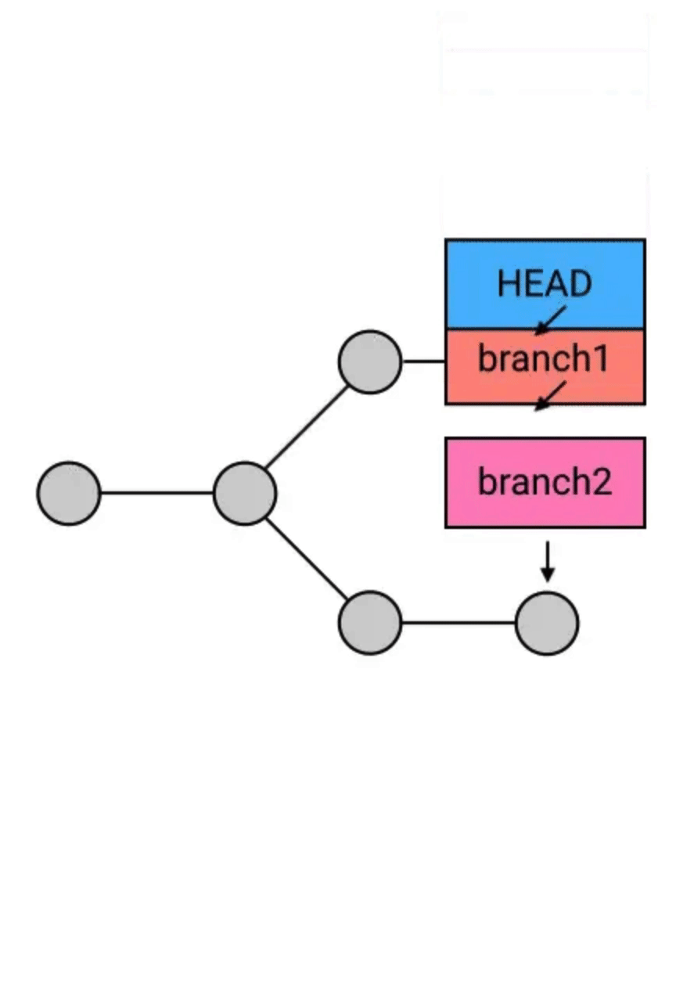
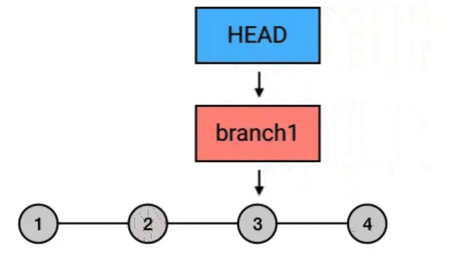
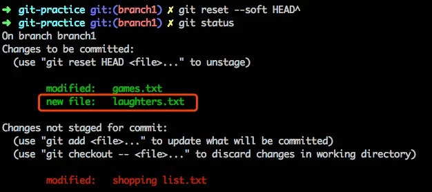
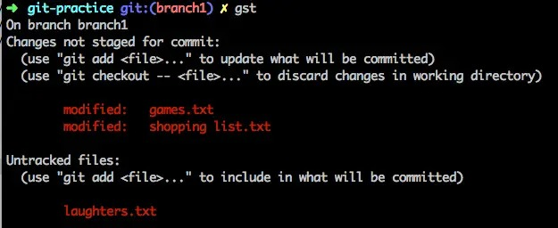

在最新的 `commit` 写错时，可以用 `reset --hard` 来把 `commit` 撤销：

```shell
git reset --hard HEAD^
```

> 用这行代码可以撤销掉当前 `commit`

在这节里，就对 `reset` 多说点，说说它的本质，说说它在撤销提交之外的用途。

## reset 的本质：移动 HEAD 以及它所指向的 branch

实质上，`reset` 这个指令虽然可以用来撤销 `commit` ，但它的实质行为并不是撤销，而是移动 `HEAD` ，并且「捎带」上 `HEAD` 所指向的 `branch`（如果有的话）。也就是说，`reset` 这个指令的行为其实和它的字面意思 "reset"（重置）十分相符：它是用来重置 `HEAD` 以及它所指向的 `branch` 的位置的。

而 `reset --hard HEAD^` 之所以起到了撤销 `commit` 的效果，是因为它把 `HEAD` 和它所指向的 `branch` 一起移动到了当前 `commit` 的父 `commit` 上，从而起到了「撤销」的效果：


> Git 的历史只能往回看，不能向未来看，所以把 `HEAD` 和 `branch` 往回移动，就能起到撤回 `commit` 的效果。

所以同理，`reset --hard` 不仅可以撤销提交，还可以用来把 `HEAD` 和 `branch` 移动到其他的任何地方。

```shell
git reset --hard branch2
```



不过……`reset` 后面总是跟着的那个 `--hard` 是什么意思呢？

`reset` 指令可以重置 `HEAD` 和 `branch` 的位置，不过在重置它们的同时，对工作目录可以选择不同的操作，而对工作目录的操作的不同，就是通过 `reset` 后面跟的参数来确定的。

## reset --hard：重置工作目录

`reset --hard` 会在重置 `HEAD` 和 `branch` 的同时，重置工作目录里的内容。当你在 `reset` 后面加了 `--hard` 参数时，你的工作目录里的内容会被完全重置为和 `HEAD` 的新位置相同的内容。换句话说，就是你的未提交的修改会被全部擦掉。

例如你在上次 `commit` 之后又对文件做了一些改动：

```shell
git status
```


然后，你执行了 `reset` 并附上了 `--hard` 参数：

```shell
git reset --hard HEAD^
```

你的 `HEAD` 和当前 `branch` 切到上一条 `commit` 的同时，你工作目录里的新改动也一起全都消失了，不管它们是否被放进暂存区：

```shell
git status
```


可以看到，在 `reset --hard` 后，所有的改动都被擦掉了。

## reset --soft：保留工作目录

`reset --soft` 会在重置 `HEAD` 和 `branch` 时，保留工作目录和暂存区中的内容，并把重置 `HEAD` 所带来的新的差异放进暂存区。

什么是「重置 `HEAD` 所带来的新的差异」？就是这里：



由于 `HEAD` 从 `4` 移动到了 `3`，而且在 `reset` 的过程中工作目录的内容没有被清理掉，所以 `4` 中的改动在 `reset` 后就也成了工作目录新增的「工作目录和 `HEAD` 的差异」。这就是上面一段中所说的「重置 `HEAD` 所带来的差异」。

所以在同样的情况下：

```shell
git status
```


假设此时当前 `commit` 的改动内容是新增了 `laughters.txt` 文件：

```shell
git show --stat
```


如果这时你执行：

```shell
git reset --soft HEAD^
```

那么除了 `HEAD` 和它所指向的 `branch1` 被移动到 `HEAD^` 之外，原先 `HEAD` 处 `commit` 的改动（也就是那个 `laughters.txt` 文件）也会被放进暂存区：

```shell
git status
```



这就是 `--soft` 和 `--hard` 的区别：`--hard` 会清空工作目录的改动，而 `--soft` 则会保留工作目录的内容，并把因为保留工作目录内容所带来的新的文件差异放进暂存区。

## reset 不加参数：保留工作目录，并清空暂存区

`reset` 如果不加参数，那么默认使用 `--mixed` 参数。它的行为是：保留工作目录，并且清空暂存区。也就是说，工作目录的修改、暂存区的内容以及由 `reset` 所导致的新的文件差异，都会被放进工作目录。简而言之，就是「把所有差异都混合（mixed）放在工作目录中」。

还以同样的情况为例：

```shell
git status
```


> 修改了 `games.txt` 和 `shopping list.txt`，并把 `games.txt` 放进了暂存区。

```shell
git show --stat
```


> 最新的 `commit` 中新增了 `laughters.txt` 文件。

这时如果你执行无参数的 `reset`：

```shell
git reset HEAD^
```

工作目录的内容和 `--soft` 一样会被保留，但和 `--soft` 的区别在于，它会把暂存区清空：

```shell
git status
```



## 小结

`reset` 指令的本质：重置 `HEAD` 以及它所指向的 `branch` 的位置。同时，介绍了 `reset` 的三种参数：

1.  `--hard`：重置位置的同时，清空工作目录的所有改动；
2.  `--soft`：重置位置的同时，保留工作目录和暂存区的内容，并把重置 `HEAD` 的位置所导致的新的文件差异放进暂存区。
3.  `--mixed`（默认）：重置位置的同时，保留工作目录的内容，并清空暂存区。
