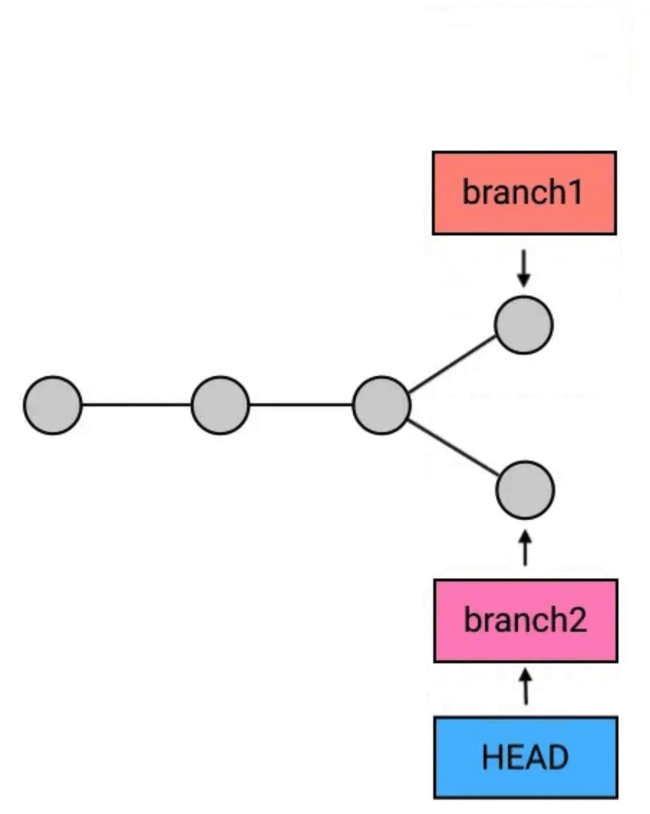
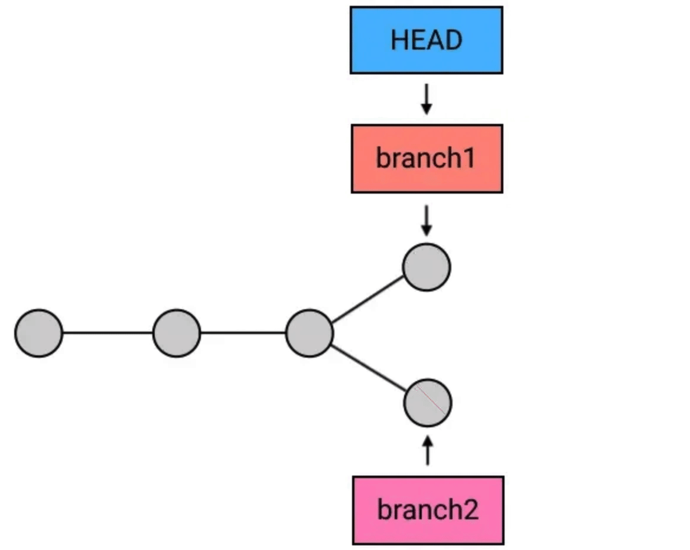

在以前的学习中`checkout` 可以用来切换 `branch`：

```shell
git checkout branch2
```



不过实质上，`checkout` 并不止可以切换 `branch`。`checkout` 本质上的功能其实是：签出（ checkout ）指定的 `commit`。

`git checkout branch名` 的本质，其实是把 `HEAD` 指向指定的 `branch`，然后签出这个 `branch` 所对应的 `commit` 的工作目录。所以同样的，`checkout` 的目标也可以不是 `branch`，而直接指定某个 `commit`：

```shell
git checkout HEAD^^
```

```shell
git checkout master~5
```

```shell
git checkout 78a4bc
```

```shell
git checkout 78a4bc^
```

这些都是可以的。

另外，如果你留心的话可能会发现，在 `git status` 的提示语中，Git 会告诉你可以用 `checkout -- 文件名` 的格式，通过「签出」的方式来撤销指定文件的修改：


## 小结

`checkout` 的本质是签出指定的 `commit`，所以你不止可以切换 `branch`，也可以直接指定 `commit` 作为参数，来把 `HEAD` 移动到指定的 `commit`。

## checkout 和 reset 的不同

`checkout` 和 `reset` 都可以切换 `HEAD` 的位置，它们除了有许多细节的差异外，最大的区别在于：`reset` 在移动 `HEAD` 时会带着它所指向的 `branch` 一起移动，而 `checkout` 不会。当你用 `checkout` 指向其他地方的时候，`HEAD` 和 它所指向的 `branch` 就自动脱离了。

事实上，`checkout` 有一个专门用来只让 `HEAD` 和 `branch` 脱离而不移动 `HEAD` 的用法：

```shell
git checkout --detach
```

执行这行代码，Git 就会把 `HEAD` 和 `branch` 脱离，直接指向当前 `commit`：


