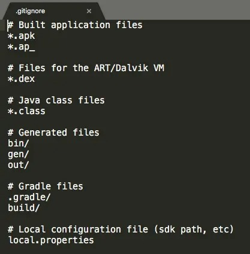

## .gitignore 排除不想被管理的文件和目录

在 Git 中有一个特殊的文本文件：`.gitignore`。这个文本文件记录了所有你希望被 Git 忽略的目录和文件。

如果你是在 GitHub 上创建仓库，你可以在创建仓库的界面中就通过选项来让 GitHub 帮你创建好一个符合项目类型的 `.gitignore` 文件，你就不用再自己麻烦去写一大堆的配置了。不过如果你不是在 GitHub 上创建的项目，或者你对 GitHub 帮你创建的 `.gitignore` 文件有一些额外的补充，那么你可以自己来编辑这个文件。

`.gitignore`大概长这样：

> 这是 Android 项目的 `.gitignore` 文件，每种项目的 `.gitignore` 文件的内容都不一样。

文件中 `#` 打头的是注释文件，其他的都是对忽略文件的配置。匹配规则从上图中就能看出个大致，具体的匹配规则可以去官网的相关条目查看：

[git-scm.com/docs/gitign…](https://link.juejin.cn/?target=https%3A%2F%2Fgit-scm.com%2Fdocs%2Fgitignore "https://git-scm.com/docs/gitignore")
