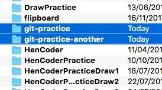
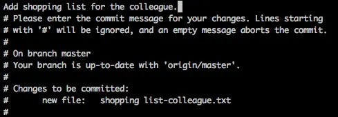
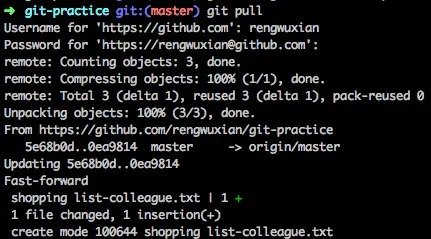

对于 Git 来说，团队合作和个人独立工作最大的不同在于，你会提交代码，别人也会提交；你会 push，别人也会 push，因此除了把代码上传，每个人还需要把别人最新的代码下载到自己的电脑。而且，这些工作都是并行进行的。

这就很复杂了！

团队合作中 Git 的基本工作模型。

## 把别人的新提交拿到本地

先说一种简单的情况：你的同事刚把他写的几个提交 push 到了中央仓库，你怎么把它们取下来。

### 假装同事

除非你能要求同事陪你练习 Git，否则，你只能一人分饰两角：时不时地模拟一下同事的操作，来达到独自一人做多人项目练习的效果。而为了模拟同事的操作，你需要在你的 `/git-practice` 目录旁再 clone 一次中央仓库到本地，来当做你的模拟同事的本地仓库：

```shell
git clone https://github.com/rengwuxian/git-practice.git git-practice-another
```

> 注意！执行这条之前别忘了先 `cd ..` 切换到父目录，不然你会把新的本地仓库创建在原先的本地仓库的工作目录内。

为了目录名称不冲突，这次的 `clone` 需要加一个额外参数（上面那行代码最后的 `git-practice-another`）来手动指定本地仓库的根目录名称。在这条指令执行完成后，你就有了两个内容相同的本地仓库：



现在，你就可以假装 `/git-practice` 这个目录是你的电脑上的工作目录，而那个新建的 `/git-practice-another` 是你同事的电脑上的工作目录。


如果你对这样的操作有担心，大可不必，这种操作不会有任何问题。因为 Git 的管理是目录级别，而不是设备级别的。也就是说，`/git-practice` 目录内的 `.git` 只管理 `/git-practice` 里的内容，`/git-practice-another` 目录内的 `.git` 也只管理 `/git-practice-another` 里的内容，它们之间互不知晓，也互不影响。

### 帮同事提交代码并 push 到中央仓库

要在你的电脑上把同事的代码取下来，首先 GitHub 上要有你同事的新代码，也就是说，你首先要把同事的代码 push 到中央仓库去。所以第一步，切换到同事的目录：

```shell
cd git-practice-another
```

现在，到了同事的工作目录，你的身份就是你的同事了。帮他写点代码吧！嗯……写点什么好呢？


嗯，看起来不错，帮他提交吧：

```shell
git add shopping\ list-colleague.txt git commit
```



提交完成以后，`push` 到 GitHub：

```shell
git push
```


## 把同事 push 的新代码取下来

GitHub 上有了同事的新代码以后，你就可以变回自己，把「他」刚 push 上去的代码取到你的仓库了。首先，切回 `/git-practice` 目录：

```shell
cd ../git-practice
```

然后，把同事的代码取下来吧！从远程仓库更新内容，用的是一个新的指令：`pull`。

```shell
git pull
```



这时候再看看你的本地目录，可以看到，同事提交的 `shopping list-colleagure.txt` 已经同步到本地了。也就是说，现在你的本地仓库和同事的又一致了。

## 多人合作的基本工作模型

这就完成了一次简单的合作流程：

1.  同事 `commit` 代码到他的本地，并 `push` 到 GitHub 中央仓库
2.  你把 GitHub 的新提交通过 `pull` 指令来取到你的本地

通过这个流程，你和同事就可以简单地合作了：你写了代码，`commit`，`push` 到 GitHub，然后他 `pull` 到他的本地；他再写代码，`commit`, `push` 到 GitHub，然后你再 `pull` 到你的本地。你来我往，配合得不亦乐乎。

但是，这种合作有一个严重的问题：同一时间内，只能有一个人在工作。你和同事其中一个人写代码的时候，另一个人不能做事，必须等着他把工作做完，代码 `push` 到 GitHub 以后，自己才能把 `push` 上去的代码 `pull` 到自己的本地。而如果同时做事，就会发生冲突：当一个人先于另一个人 `push` 代码（这种情况必然会发生），那么后 `push` 的这个人就会由于中央仓库上含有本地没有的提交而导致 `push` 失败。

> 为什么会失败？
>
> 因为 Git 的 `push` 其实是用本地仓库的 commits 记录去覆盖远端仓库的 commits 记录（注：这是简化概念后的说法，push 的实质和这个说法略有不同），而如果在远端仓库含有本地没有的 commits 的时候，`push` （如果成功）将会导致远端的 commits 被擦掉。这种结果当然是不可行的，因此 Git 会在 `push` 的时候进行检查，如果出现这样的情况，push 就会失败。

怎么办？

## push 发生冲突

在现实的团队开发中，全队是同时并行开发的，所以必然会出现当一人 `push` 代码时，中央仓库已经被其他同事先一步 `push` 了的情况。为了不让文段显得太过混乱，这里我就不带着你一步步模拟这个过程了。如果你希望模拟的话，这里是步骤：

1.  切到 `git-practice-another` 去，假扮成你的同事做一个 `commit`，然后 `push` 到 GitHub
2.  切回 `git-practice` 变回你自己，做一个不一样的 `commit`。

这个时候，远端中央仓库已经有了别人 `push` 的 `commit`，现在你如果 `push` 的话：

```shell
git push
```


从上图中的提示语可以看出来（好吧这么长的提示语有人表示不想看），由于 GitHub 的远端仓库上含有本地仓库没有的内容，所以这次 `push` 被拒绝了。这种冲突的解决方式其实很简单：**先用 `pull` 把远端仓库上的新内容取回到本地和本地合并，然后再把合并后的本地仓库向远端仓库推送**。

```shell
git pull
```


在上面的文段里，我已经举过一次 `git pull` 的例子，但这次的 `git pull` 操作并没有像之前的那样直接结束，而是进入了上图这样的一个输入提交信息的界面。这是因为当 `pull` 操作发现不仅远端仓库包含本地没有的 `commit`s，而且本地仓库也包含远端没有的 `commit`s 时，它就会把远端和本地的独有 `commit`s 进行合并，自动生成一个新的 `commit` ，而上图的这个界面，就是这个自动生成的 `commit` 的提交信息界面。另外，和手动的 `commit` 不同，这种 `commit` 会自动填入一个默认的提交信息，简单说明了这条 `commit` 的来由。你可以直接退出界面来使用这个自动填写的提交信息，也可以修改它来填入自己提交信息。

> 这种「把不同的内容进行合并，生成新的提交」的操作，叫做合并（呵呵呵哈哈），它所对应的 Git 指令是 `merge`。事实上，`git pull` 这个指令的内部实现就是把远程仓库使用 `git fetch` 取下来以后再进行 `merge` 操作的。关于更多 `merge` 的介绍，我会在后面说，这节先不讲了。

在退出提交信息的界面后，这次 `pull` 就完成了：远端仓库被取到了本地，并和本地仓库进行了合并。在这个时候，就可以再 `push` 一次了。由于现在本地仓库已经包含了所有远端仓库的 commits，所以这次 `push` 不会再失败：

```shell
git push
```


这样，就把 `push` 时本地仓库和远端仓库内容冲突的问题解决了。

## 小结：多人合作的基本工作模型 2.0

1.  写完所有的 `commit` 后，不用考虑中央仓库是否有新的提交，直接 `push` 就好
2.  如果 `push` 失败，就用 `pull` 把本地仓库的提交和中央仓库的提交进行合并，然后再 `push` 一次
