HEAD、master 以及 Git 中非常重要的一个概念： branch

## 引用：commit 的快捷方式

首先，再看一次 `log`：

```shell
git log
```

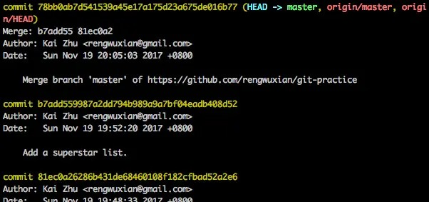

第一行的 `commit` 后面括号里的 `HEAD -> master, origin/master, origin/HEAD` ，是几个指向这个 `commit` 的引用。在 Git 的使用中，经常会需要对指定的 `commit` 进行操作。每一个 `commit` 都有一个它唯一的指定方式——它的 SHA-1 校验和，也就是上图中每个黄色的 `commit` 右边的那一长串字符。两个 SHA-1 值的重复概率极低，所以你可以使用这个 SHA-1 值来指代 `commit`，也可以只使用它的前几位来指代它（例如第一个 `78bb0ab7d541…16b77`，你使用 `78bb0ab` 甚至 `78bb` 来指代它通常也可以），但毕竟这种没有任何含义的字符串是很难记忆的，所以 Git 提供了「引用」的机制：使用固定的字符串作为引用，指向某个 `commit`，作为操作 `commit` 时的快捷方式。

## HEAD：当前 commit 的引用

上一段里说到，图中括号里是指向这个 `commit` 的引用。其中这个括号里的 `HEAD` 是引用中最特殊的一个：它是**指向当前 `commit` 的引用**。所谓\*\*当前 `commit`\*\*这个概念很简单，它指的就是当前工作目录所对应的 `commit`。

例如上图中的当前 `commit` 就是第一行中的那个最新的 `commit`。每次当有新的 `commit` 的时候，工作目录自动与最新的 `commit` 对应；而与此同时，`HEAD` 也会转而指向最新的 `commit`。事实上，当使用 `checkout`、`reset` 等指令手动指定改变当前 `commit` 的时候，`HEAD` 也会一起跟过去。

总之，当前 `commit` 在哪里，`HEAD` 就在哪里，这是一个永远自动指向当前 `commit` 的引用，所以你永远可以用 `HEAD` 来操作当前 `commit`。

## branch

`HEAD` 是 Git 中一个独特的引用，它是唯一的。而除了 `HEAD` 之外，Git 还有一种引用，叫做 `branch`（分支）。`HEAD` 除了可以指向 `commit`，还可以指向一个 `branch`，当它指向某个 `branch` 的时候，会通过这个 `branch` 来间接地指向某个 `commit`；另外，当 `HEAD` 在提交时自动向前移动的时候，它会像一个拖钩一样带着它所指向的 `branch` 一起移动。

例如上面的那张图里，`HEAD -> master` 中的 `master` 就是一个 `branch` 的名字，而它左边的箭头 `->` 表示 `HEAD` 正指向它（当然，也会间接地指向它所指向的 `commit`）。


如果我在这时创建一个 `commit`，那么 `HEAD` 会带着 `master` 一起移动到最新的 `commit`：

```shell
git commit
```

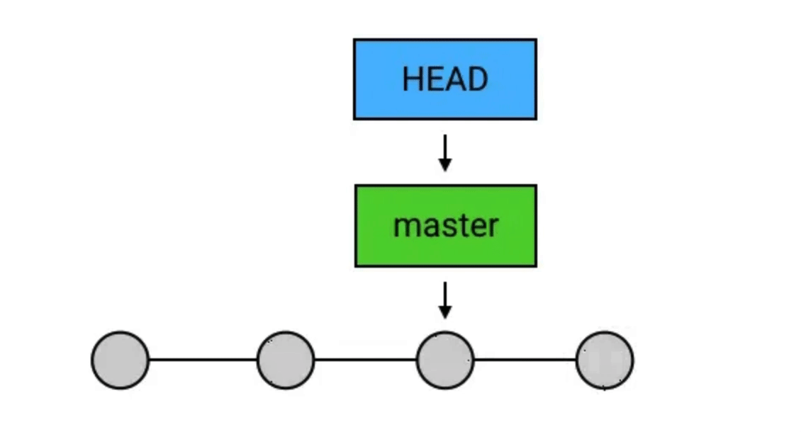

通过查看 `log`，可以对这个逻辑进行验证：

```shell
git log
```

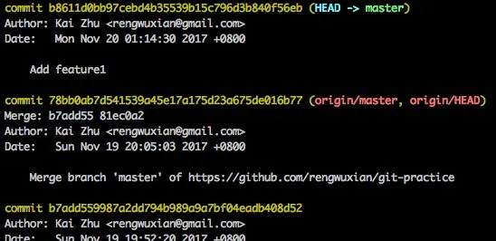

从图中可以看出，最新的 `commit` （提交信息："Add feature1"）被创建后，`HEAD` 和 `master` 这两个引用都指向了它，而在上面第一张图中的后两个引用 `origin/master` 和 `origin/HEAD` 则依然停留在原先的位置。

## master: 默认 branch

上面的这个 `master` ，其实是一个特殊的 `branch`：它是 Git 的默认 `branch`（俗称主 `branch` / 主分支）。

所谓的「默认 branch」，主要有两个特点：

1.  新创建的 repository（仓库）是没有任何 `commit` 的。但在它创建第一个 `commit` 时，会把 `master` 指向它，并把 `HEAD` 指向 `master`。

    

2.  当有人使用 `git clone` 时，除了从远程仓库把 `.git` 这个仓库目录下载到工作目录中，还会 `checkout` （签出） `master`（`checkout` 的意思就是把某个 `commit` 作为当前 `commit`，把 `HEAD` 移动过去，并把工作目录的文件内容替换成这个 `commit` 所对应的内容）。

    

另外，需要说一下的是，大多数的开发团队会规定开发以 `master` 为核心，所有的分支都在一定程度上围绕着 `master` 来开发。这个在事实上构成了 `master` 和其它分支在地位上的一个额外的区别。

## branch 的通俗化理解

尽管在 Git 中，`branch` 只是一个指向 `commit` 的引用，但它有一个更通俗的理解：你还可以把一个 `branch` 理解为从初始 `commit` 到 `branch` 所指向的 `commit` 之间的所有 `commit`s 的一个「串」。例如下面这张图：

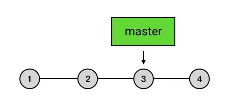

`master` 的本质是一个指向 `3` 的引用，但你也可以把 `master` 理解为是 `1` `2` `3` 三个 `commit` 的「串」，它的起点是 `1`，终点是 `3`。

这种理解方式比较符合 `branch` 这个名字的本意（branch 的本意是树枝，可以延伸为事物的分支），也是大多数人对 `branch` 的理解。不过如果你选择这样理解 `branch`，需要注意下面两点：

1.  所有的 `branch` 之间都是平等的。

    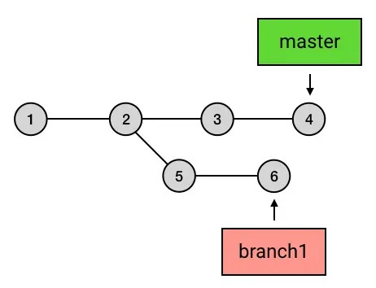

    例如上面这张图，`branch1` 是 `1` `2` `5` `6` 的串，而不要理解为 `2` `5` `6` 或者 `5` `6` 。其实，起点在哪里并不是最重要的，重要的是你要知道，所有 `branch` 之间是平等的，`master` 除了上面我说的那几点之外，并不比其他 `branch` 高级。这个认知的理解对于 `branch` 的正确使用非常重要。

    换个角度来说，上面这张图我可以用别的画法来表达，它们的意思是一样的：

    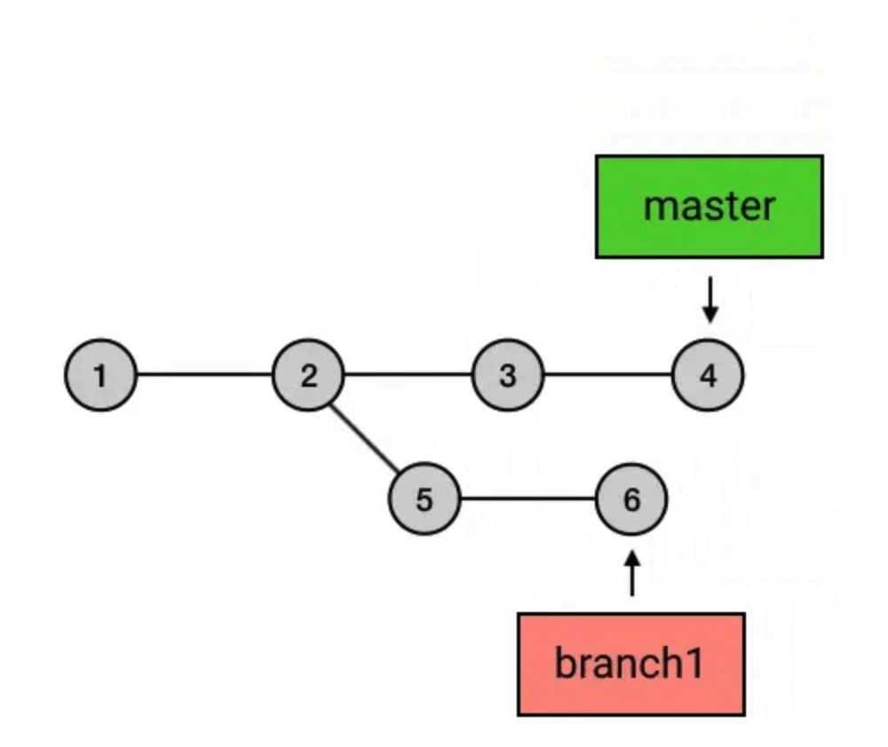

    通过这张动图应该能够对「平等」这个概念更好地理解了吧？

2.  `branch` 包含了从初始 `commit` 到它的所有路径，而不是一条路径。并且，这些路径之间也是彼此平等的。

    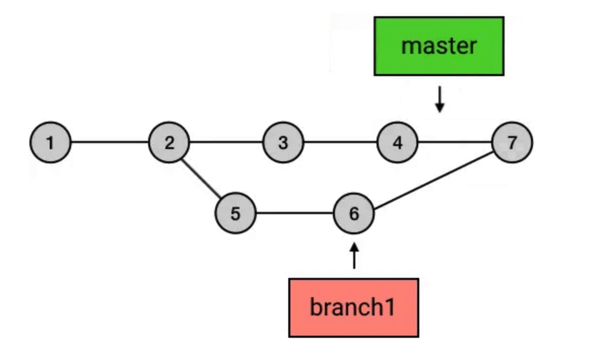

    像上图这样，`master` 在合并了 `branch1` 之后，从初始 `commit` 到 `master` 有了两条路径。这时，`master` 的串就包含了 `1` `2` `3` `4` `7` 和 `1` `2` `5` `6` `7` 这两条路径。而且，这两条路径是平等的，`1` `2` `3` `4` `7` 这条路径并不会因为它是「原生路径」而拥有任何的特别之处。

如果你喜欢用「树枝」的概念来理解 Git 的 `branch`，一定要注意上面说的这两点，否则在今后使用 `branch` 的时候就可能与出现理解偏差或者使用方式不当的问题。事实上我本人并不喜欢用这种方式来理解 `branch`，因为觉得它有点舍近求远的味道：我为了「直观」地思考，给它了一个形象的比喻，但由于它的本质含义其实更加简单，导致我的这种比喻反而增加了思考它时的复杂度，未免有点画蛇添足。不过这是我自己的感受，怎么理解 `branch` 是个个人偏好的问题，这两种理解方式你选一个喜欢的就好。

## branch 的创建、切换和删除

### 创建 branch

如果你想在某处创建 `branch` ，只需要输入一行 `git branch 名称`。例如你现在在 `master` 上：

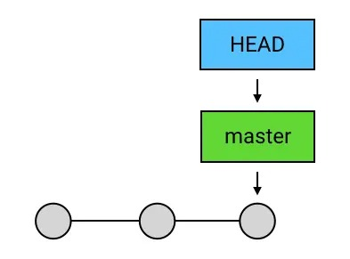

你想在这个 `commit` 处创建一个叫做 "feature1" 的 `branch`，只要输入：

```shell
git branch feature1
```

你的 `branch` 就创建好了：

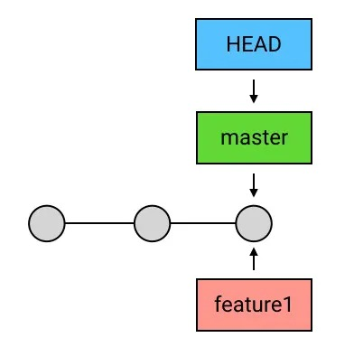

### 切换 branch

不过新建的 `branch` 并不会自动切换，你的 `HEAD` 在这时依然是指向 `master` 的。你需要用 `checkout` 来主动切换到你的新 `branch` 去：

```shell
git checkout feature1
```

然后 `HEAD` 就会指向新建的 `branch` 了：

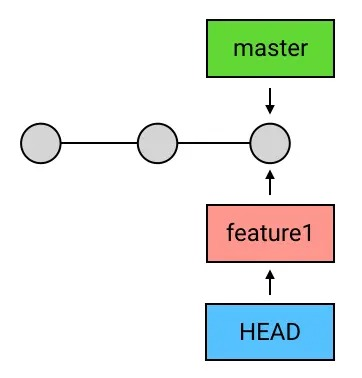

除此之外，你还可以用 `git checkout -b 名称` 来把上面两步操作合并执行。这行代码可以帮你用指定的名称创建 `branch` 后，再直接切换过去。还以 `feature1` 为例的话，就是：

```shell
git checkout -b feature1
```

在切换到新的 `branch` 后，再次 `commit` 时 `HEAD` 就会带着新的 `branch` 移动了：

```shell
... git commit
```

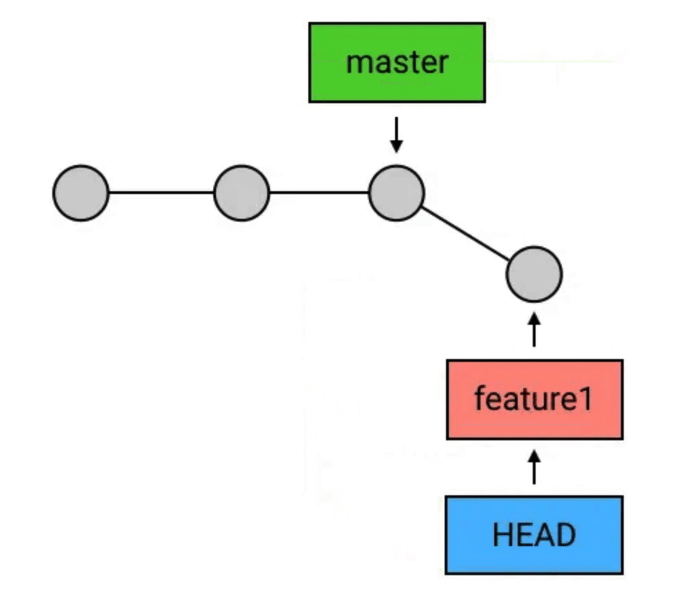

而这个时候，如果你再切换到 `master` 去 `commit`，就会真正地出现分叉了：

```shell
git checkout master ... git commit
```

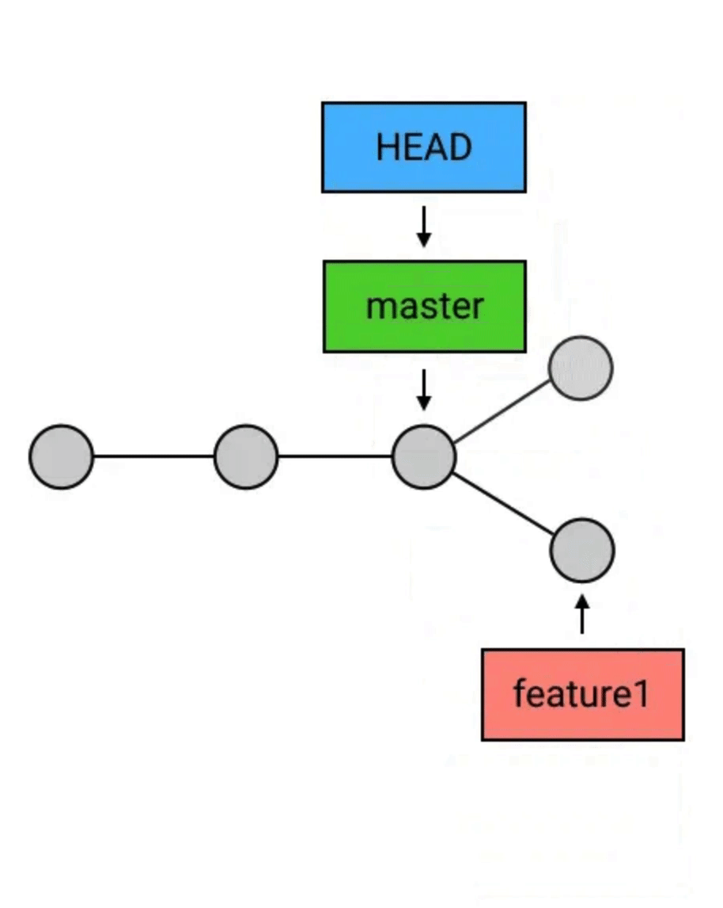

### 删除 branch

删除 `branch` 的方法非常简单：`git branch -d 名称`。例如要删除 `feature1` 这个 branch：

```shell
git branch -d feature1
```

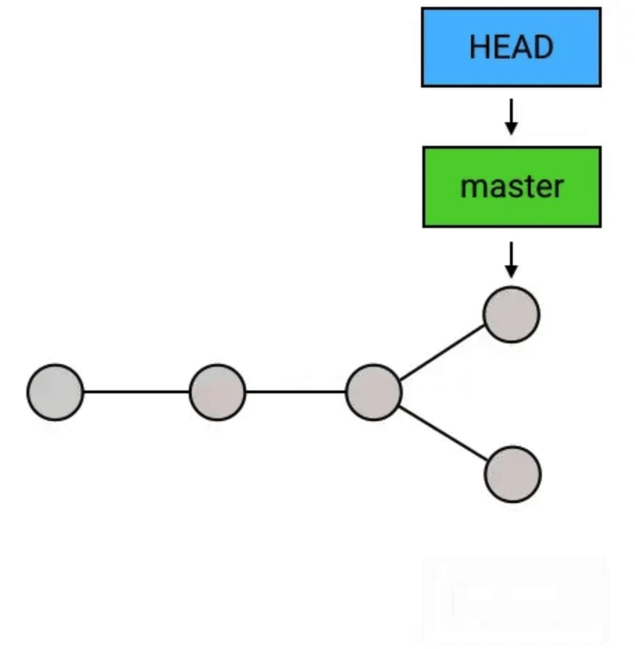

需要说明的有两点：

1.  `HEAD` 指向的 `branch` 不能删除。如果要删除 `HEAD` 指向的 `branch`，需要先用 `checkout` 把 `HEAD` 指向其他地方。
2.  由于 Git 中的 `branch` 只是一个引用，所以删除 `branch` 的操作也只会删掉这个引用，并不会删除任何的 `commit`。（不过如果一个 `commit` 不在任何一个 `branch` 的「路径」上，或者换句话说，如果没有任何一个 `branch` 可以回溯到这条 `commit`（也许可以称为野生 `commit`？），那么在一定时间后，它会被 Git 的回收机制删除掉。）
3.  出于安全考虑，没有被合并到 `master` 过的 `branch` 在删除时会失败（因为怕你误删掉「未完成」的 `branch` 啊）：

    

    这种情况如果你确认是要删除这个 `branch` （例如某个未完成的功能被团队确认永久毙掉了，不再做了），可以把 `-d` 改成 `-D`，小写换成大写，就能删除了。

    

## 「引用」的本质

所谓「引用」（reference），其实就是一个个的字符串。这个字符串可以是一个 `commit` 的 SHA-1 码（例：`c08de9a4d8771144cd23986f9f76c4ed729e69b0`），也可以是一个 `branch`（例：`ref: refs/heads/feature3`）。

Git 中的 `HEAD` 和每一个 `branch` 以及其他的引用，都是以文本文件的形式存储在本地仓库 `.git` 目录中，而 Git 在工作的时候，就是通过这些文本文件的内容来判断这些所谓的「引用」是指向谁的。

## 小结

1.  `HEAD` 是指向当前 `commit` 的引用，它具有唯一性，每个仓库中只有一个 `HEAD`。在每次提交时它都会自动向前移动到最新的 `commit` 。
2.  `branch` 是一类引用。`HEAD` 除了直接指向 `commit`，也可以通过指向某个 `branch` 来间接指向 `commit`。当 `HEAD` 指向一个 `branch` 时，`commit` 发生时，`HEAD` 会带着它所指向的 `branch` 一起移动。
3.  `master` 是 Git 中的默认 `branch`，它和其它 `branch` 的区别在于：
    1.  新建的仓库中的第一个 `commit` 会被 `master` 自动指向；
    2.  在 `git clone` 时，会自动 `checkout` 出 `master`。
4.  `branch` 的创建、切换和删除：
    1.  创建 `branch` 的方式是 `git branch 名称` 或 `git checkout -b 名称`（创建后自动切换）；
    2.  切换的方式是 `git checkout 名称`；
    3.  删除的方式是 `git branch -d 名称`。
