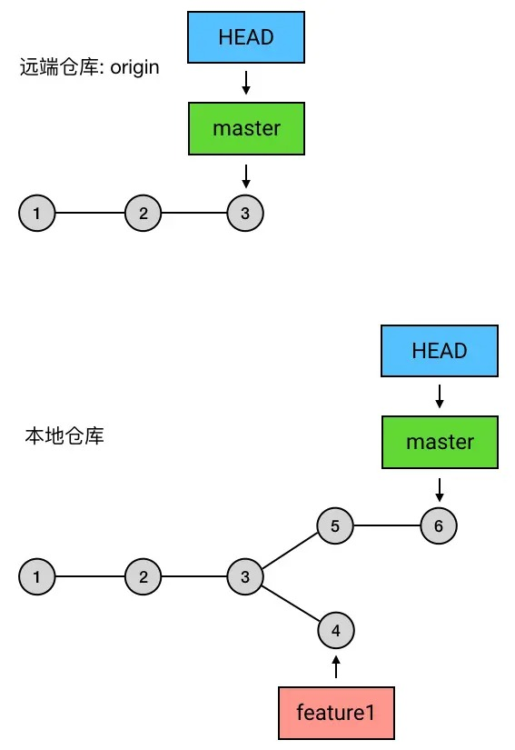
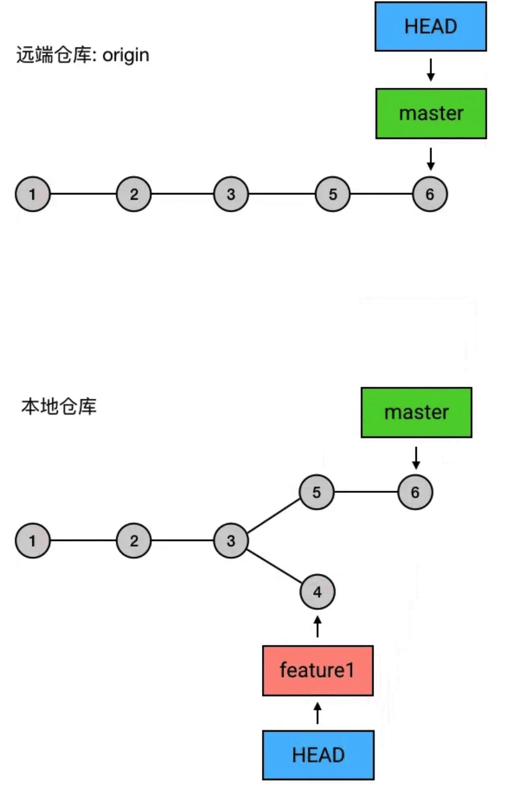

`push` 指令做的事是把你的本地提交上传到中央仓库去，用本地的内容来覆盖掉远端的内容。

## push：把 branch 上传到远端仓库

实质上，`push` 做的事是：把当前 `branch` 的位置（即它指向哪个 `commit`）上传到远端仓库，并把它的路径上的 `commits` 一并上传。

例如，我现在的本地仓库有一个 `master` ，它超前了远程仓库两个提交；另外还有一个新建的 `branch` 叫 `feature1`，远程仓库还没有记载过它。具体大概像这样：



这时我执行 `git push`，就会把 `master` 的最新位置更新到远端，并且把它的路径上的 `5` `6` 两个 `commit`s 上传：

```shell
git push
```


而如果这时候我再切到 `feature1` 去后再执行一次 `push`，就会把 `feature1` 以及它的 `commit` `4` 上传到远程仓库：

```shell
git checkout feature1 git push origin feature1
```

> 这里的 `git push` 和之前有点不同：多了 `origin feature1` 这两个参数。其中 `origin` 是远程仓库的别名，是你在 `git clone` 的时候 Git 自动帮你起的；`feature1` 是远程仓库中目标 `branch` 的名字。这两个参数合起来指定了你要 `push` 到的目标仓库和目标分支，意思是「我要 push 到 `origin` 这个仓库的 `feature1` 分支」。
>
> 在 Git 中（2.0 及它之后的版本），默认情况下，你用不加参数的 `git push` 只能上传那些之前从远端 `clone` 下来或者 `pull` 下来的分支，而如果需要 `push` 你本地的自己创建的分支，则需要手动指定目标仓库和目标分支（并且目标分支的名称必须和本地分支完全相同），就像上面这样。
>
> 你可以通过 `git config` 指令来设置 `push.default` 的值来改变 `push` 的行为逻辑，例如可以设置为「所有分支都可以用 `git push` 来直接 push，目标自动指向 `origin` 仓库的同名分支」（对应的 `push.default` 值：`current`），或者别的什么行为逻辑，你甚至可以设置为每次执行 `git push` 时就自动把所有本地分支全部同步到远程仓库（虽然这可能有点耗时和危险）。如果希望详细了解，你可以到[这里](https://git-scm.com/docs/git-config#git-config-pushdefault)看看。



细心的人可能会发现，在 `feature1` 被 `push` 时，远程仓库的 `HEAD` 并没有和本地仓库的 `HEAD` 一样指向 `feature1`。这是因为，`push` 的时候只会上传当前的 `branch` 的指向，并不会把本地的 `HEAD` 的指向也一起上传到远程仓库。事实上，远程仓库的 `HEAD` 是永远指向它的默认分支（即 master，如果不修改它的名称的话），并会随着默认分支的移动而移动的。

## 小结

1.  `push` 是把当前的分支上传到远程仓库，并把这个 `branch` 的路径上的所有 `commit`s 也一并上传。
2.  `push` 的时候，如果当前分支是一个本地创建的分支，需要指定远程仓库名和分支名，用 `git push origin branch_name` 的格式，而不能只用 `git push`；或者可以通过 `git config` 修改 `push.default` 来改变 `push` 时的行为逻辑。
3.  `push` 的时候之后上传当前分支，并不会上传 `HEAD`；远程仓库的 `HEAD` 是永远指向默认分支（即 `master`）的。
