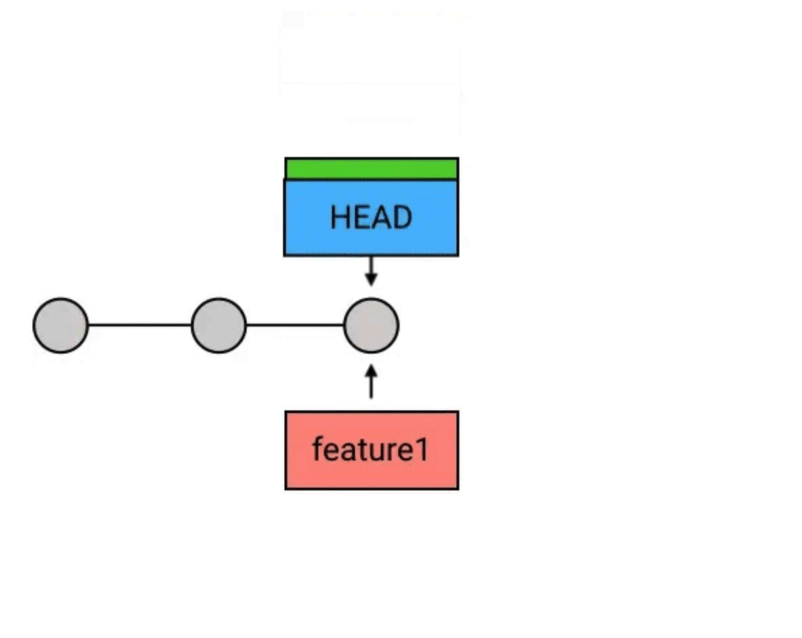
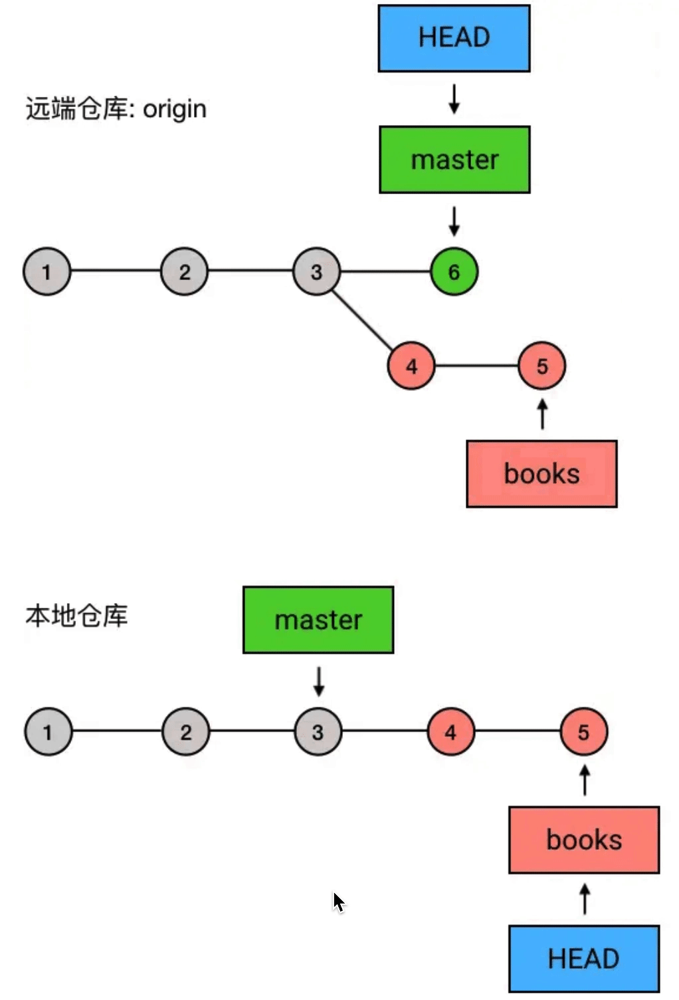
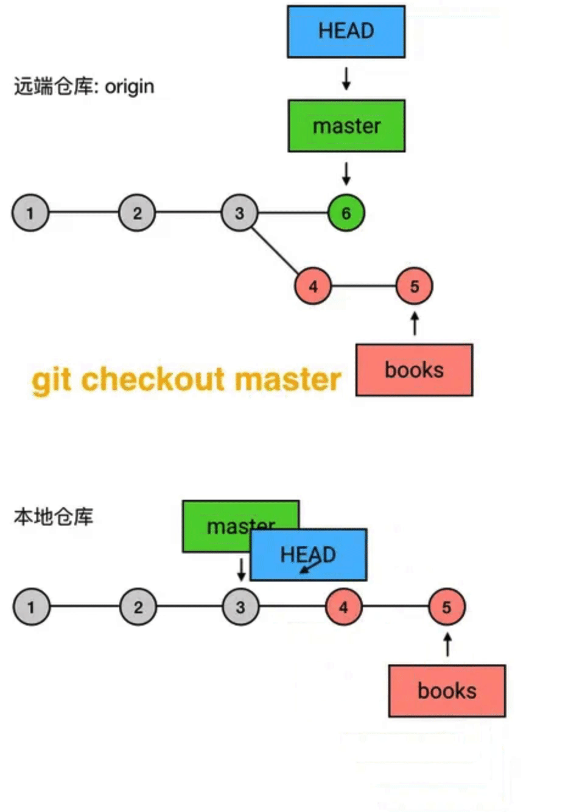
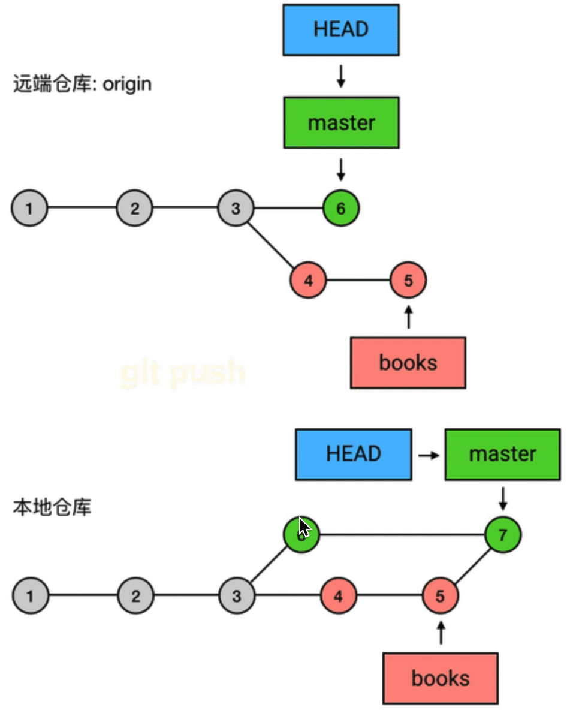
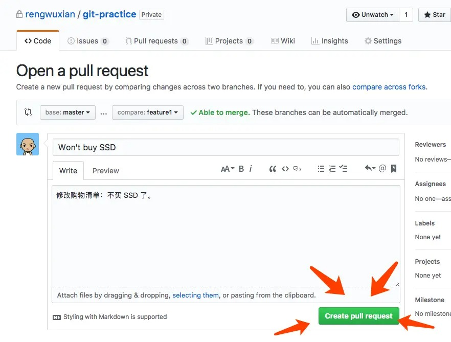
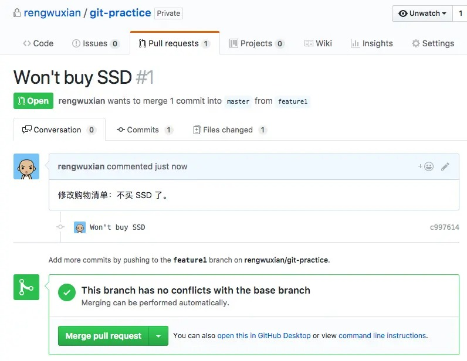
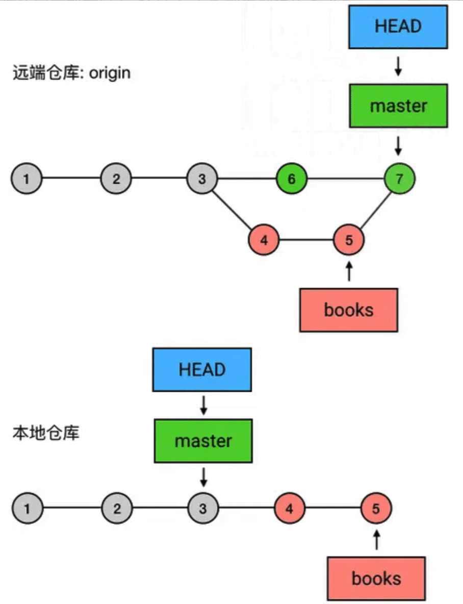

在前面的基本的团队工作模型中，所有人都工作在 `master` 上，写完了的 `commit` 可以通过 `push` 来发送到中央仓库，并且可以使用 `pull` 来获取到别人的最新 `commit`s。

这种工作模型解决了团队合作最基本的问题：多人并行开发和版本管理。事实上，这也是早期的 VCS——中央式 VCS 的工作模型。

但这种工作模型也有它的限制：使用这种工作模型时，每个人的代码在被大家看到的时候，就是它进入正式的生产库的时候。所有人的工作都会被直接 `push` 到 `master`，这导致每个人的代码在正式启用前无法被别人看到，这样就让代码在正式启用前的讨论和 review（审阅）非常不方便。现在的商业团队，开发项目多是采用「边开发边发布、边开发边更新、边开发边修复」的持续开发策略，所以代码分享的不便会极大地影响团队的开发效率。

目前最流行（不论是中国还是世界）的团队开发的工作流：Feature Branching。

## 简介

这种工作流的核心内容可以总结为两点：

1.  任何新的功能（feature）或 bug 修复全都新建一个 `branch` 来写；
2.  `branch` 写完后，合并到 `master`，然后删掉这个 `branch`。



这就是这种工作流最基本的模型。

从上面的动图来看，这种工作流似乎没什么特别之处。但实质上，Feature Branching 这种工作流，为团队开发时两个关键的问题——代码分享和一人多任务——提供了解决方案。

## 1\. 代码分享

假设你在一个叫做「微信阅读」的团队工作，现在你要开发一个叫做「在线书架」的功能，于是你创建了一个新的 `branch` 叫做 `books`，然后开始在 `books` 上进行开发工作。

```shell
git checkout -b books
```

在十几个 `commit`s 过后，「在线书架」的基本功能开发完毕，你就把代码 `push` 到中央仓库（例如 GitHub）去，然后告诉同事：「嘿，书架的基本功能写完了，分支名是 `books`，谁有空的话帮我 review 一下吧。」

```shell
git push origin books
```



然后你的同事明明正好有空，他就从中央仓库拉下来了你的代码开始读：

```shell
# 明明的电脑：
git pull git chekcout books
```

读完以后，明明对你说说，嗯我看完了，我觉得不错，可以合并到 `master`！

于是你就把 `books` 合并到了 `master` 上去：

```shell
git checkout master
git pull # merge 之前 pull 一下，让 master 更新到和远程仓库同步
git merge books
```



紧接着，你把合并后的结果 `push` 到了中央仓库，并删掉了 `books` 这个 `branch`：

```shell
git push
git branch -d books
git push origin -d books # 用 -d 参数把远程仓库的 branch 也删了
```



### 如果同事有意见

上面的例子是明明对你的代码没有意见，而假如他在你的代码里看到了问题，例如他跑来对你说：「嘿，你的代码缩进为什么用的是 TAB？快改成空格，不然砍死你哦！」

这时，你就可以把你的缩进改成空格，然后做一个新的提交，再 `push` 上去，然后通知他：「我改完啦！」

明明 `pull` 下来你的新提交看了看：「嗯，这下可以合并了。」

于是你依照上面的那一套操作，把代码合并进 `master`，并 `push` 了上去，然后删掉了 `books`。

瞧，代码在同事竖大拇指之前都不会正式发布到 `master`，挺方便的吧？

### Pull Request

事实上，上面讲的这个流程，还可以利用 Pull Request 来进一步简化。

Pull Request 并不是 Git 的内容，而是一些 Git 仓库服务提供方（例如 GitHub）所提供的一种便捷功能，它可以让团队的成员方便地讨论一个 `branch` ，并在讨论结束后一键合并这个 `branch` 到 `master`。

同样是把写好的 `branch` 给同事看，使用 Pull Request 的话你可以这样做：

1.  把 `branch` `push` 到中央仓库；
2.  在中央仓库处创建一个 Pull Request。以 GitHub 为例：

    

    

    

    然后你的同事就可以在 GitHub 上看到你创建的 Pull Request 了。他们可以在 GitHub 的这个页面查看你的 `commit`s，也可以给你评论表示赞同或提意见，你接下来也可以根据他们的意见把新的 `commit`s `push` 上来，这也页面会随着你新的 `push` 而展示出最新的 `commits`。

    在讨论结束以后，你们一致认为这个 `branch` 可以合并了，你只需要点一下页面中那个绿色的 "Merge pull request" 按钮，GitHub 就会自动地在中央仓库帮你把 `branch` 合并到 `master` 了：

    

    然后你只要在本地 `pull` 一下，把最新的内容拉到你的电脑上，这件事情就算完成了。

    另外，GitHub 还设计了一个贴心的 "Delete branch" 按钮，方便你在合并之后一键删除 `branch`。

    

## 2\. 一人多任务

除了代码分享的便捷，基于 Feature Branch 的工作流对于一人多任务的工作需求也提供了很好的支持。

安安心心做事不被打扰，做完一件再做下一件自然是很美好的事，但现实往往不能这样。对于程序员来说，一种很常见的情况是，你正在认真写着代码，忽然同事过来跟你说：「内个……你这个功能先放一放吧，我们最新讨论出要做另一个更重要的功能，你来做一下吧。」

其实，虽然这种情况确实有点烦，但如果你是在独立的 `branch` 上做事，切换任务是很简单的。你只要稍微把目前未提交的代码简单收尾一下，然后做一个带有「未完成」标记的提交（例如，在提交信息里标上「TODO」），然后回到 `master` 去创建一个新的 `branch` 就好了。

```bash
git checkout master
git checkout -b new_feature
```

> 上面这两行代码有更简单的操作方式 git checkout -b new_feature

如果有一天需要回来继续做这个 `branch`，你只要用 `checkout` 切回来，就可以继续了。

## 小结

1.  每个新功能都新建一个 `branch` 来写；
2.  写完以后，把代码分享给同事看；写的过程中，也可以分享给同事讨论。另外，借助 GitHub 等服务提供方的 Pull Request 功能，可以让代码分享变得更加方便；
3.  分支确定可以合并后，把分支合并到 `master` ，并删除分支。

这种工作流由于功能强大，而且概念和使用方式都很简单，所以很受欢迎。再加上 GitHub 等平台提供了 Pull Request 的支持，目前这种工作流是商业项目开发中最为流行的工作流。
