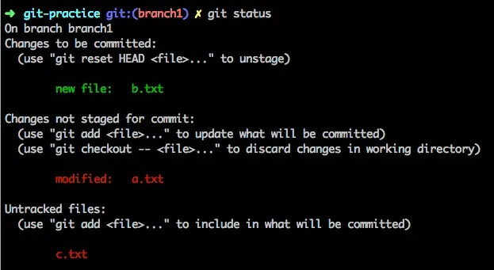
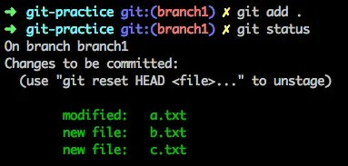
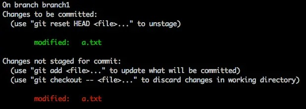

## 1\. add 后面加个点 "."：全部暂存

`add` 指令除了 `git add 文件名` 这种用法外，还可以使用 `add .` 来直接把工作目录下的所有改动全部放进暂存区：

```shell
git status
```



```shell
git add . git status
```



这个用法没什么特别的好处，但就一个字：方便！你在用的时候会更加深刻地体会到。

## 2\. add 添加的是文件改动，而不是文件名

假如你修改了文件 `a.txt`，然后把它 `add` 进了暂存区：

```shell
git add a.txt git status
```


然后你又往 `a.txt` 里写了几行东西。这时候你再 `status` 一下的话：

```shell
git status
```



你会发现你的 `a.txt` 既在 "Changes to be commited" 的暂存区，又在 "Changes not staged for commit"。不用觉得奇怪，这是因为通过 `add` 添加进暂存区的不是文件名，而是具体的文件改动内容。你在 `add` 时的改动都被添加进了暂存区，但在 `add` 之后的新改动并不会自动被添加进暂存区。在这时如果你提交：

```shell
git commit
```

那么你那些新的改动是不会被提交的。
